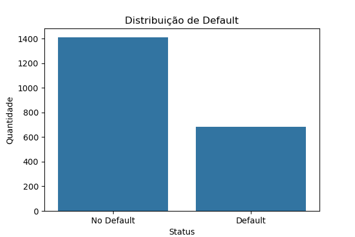
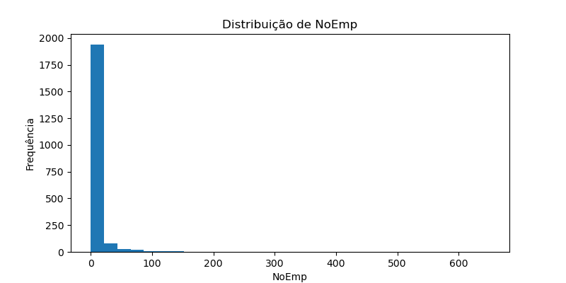
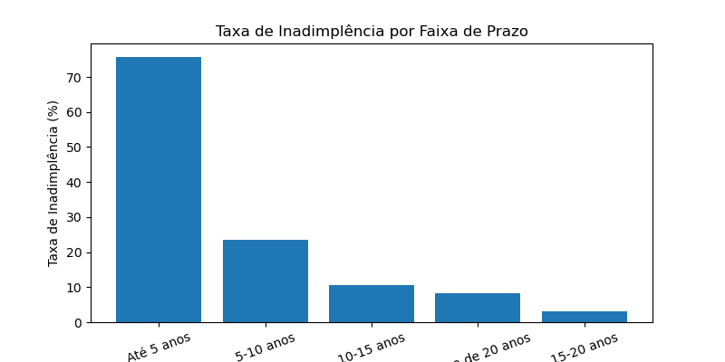
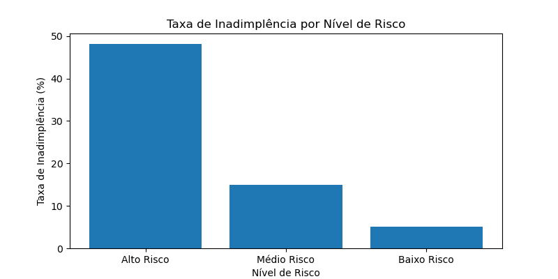

# Análise de Risco de Crédito para Pequenas Empresas

Este projeto investiga quais características das empresas e dos empréstimos estão mais associadas à inadimplência em uma base de crédito para pequenas empresas. A análise combina limpeza e preparação dos dados, análise exploratória, testes de hipóteses e a construção de um score simples e interpretável de risco para segmentar os contratos em diferentes níveis.

Para ver o desenvolvimento completo do projeto, a metodologia, os gráficos e a interpretação dos resultados, leia o artigo completo no Medium:  
**[O que os dados revelam sobre inadimplência em crédito para pequenas empresas](https://medium.com/@jamillileal8/o-que-os-dados-revelam-sobre-inadimpl%C3%AAncia-em-cr%C3%A9dito-para-pequenas-empresas-2294edd81d3e?postPublishedType=repub)**

---

# Objetivo

O principal objetivo deste projeto foi identificar quais características das empresas e dos empréstimos estão mais associadas à inadimplência.

A análise foi guiada pelas seguintes perguntas:

- Qual é a taxa geral de inadimplência da base?
- Empresas menores apresentam maior risco de default?
- Empréstimos de menor valor concentram mais inadimplência?
- O prazo do contrato influencia o risco?
- A recessão está associada ao aumento da inadimplência?
- Empresas novas inadimplem mais do que empresas já existentes?
- É possível criar um score simples para classificar os contratos em baixo, médio e alto risco?

---

# Base de Dados

Fonte: **SBA Loans Case Data Set**  
A base contém informações sobre empréstimos para pequenas empresas, incluindo perfil da empresa, características do contrato e status final do empréstimo.

Após a etapa de limpeza, a análise foi conduzida com **2.099 registros**. O artigo relata uma taxa geral de inadimplência de **32,68%**, valor médio desembolsado de **243.012,72**, prazo médio de **127,09 meses** e média de **10,16 funcionários** por empresa.

---

# Etapas do Projeto

1. **Limpeza e preparação dos dados**
   - conversão de datas;
   - limpeza de variáveis monetárias;
   - padronização de categorias;
   - tratamento de valores ausentes;
   - criação de variáveis auxiliares para análise.

2. **Análise exploratória dos dados**
   - distribuição da inadimplência;
   - distribuição do valor desembolsado;
   - distribuição do prazo do empréstimo;
   - taxa de inadimplência por porte da empresa;
   - taxa de inadimplência por prazo;
   - taxa de inadimplência por valor;
   - taxa de inadimplência por recessão;
   - boxplots comparando contratos adimplentes e inadimplentes.

3. **Testes de hipóteses**
   - teste de normalidade de Shapiro-Wilk;
   - teste de Mann-Whitney U para variáveis numéricas;
   - teste do qui-quadrado para variáveis categóricas.

4. **Construção de um score simples de risco**
   - score baseado nas variáveis mais associadas à inadimplência;
   - classificação dos contratos em baixo, médio e alto risco.

5. **Insights de negócio e recomendações**
   - identificação dos perfis de maior risco;
   - segmentação da carteira para priorização de monitoramento;
   - recomendações práticas para análise de risco de crédito.

---

# Principais Resultados

Entre os principais achados do projeto, destacam-se:

- **empresas menores apresentaram maior inadimplência;**
- **empréstimos de menor valor estiveram mais associados ao default;**
- **contratos de prazo mais curto concentraram maior inadimplência;**
- **operações expostas ao período de recessão apresentaram risco significativamente maior;**
- **a variável `RealEstate` foi uma das mais relevantes para diferenciar os grupos;**
- **nem todo padrão visual foi confirmado estatisticamente**, como no caso da diferença entre empresas novas e empresas já existentes.

Esses resultados foram sustentados tanto pela análise exploratória quanto pelos testes estatísticos realizados.

---

# Score de Risco

Foi construído um score simples e interpretável de risco com base nas seguintes variáveis:

- faixa de prazo;
- faixa de valor desembolsado;
- porte da empresa;
- indicador de recessão;
- `RealEstate`;
- linha de crédito rotativa.

Com isso, os contratos foram classificados em:

- **Baixo Risco**
- **Médio Risco**
- **Alto Risco**

A expectativa analítica foi que a taxa de inadimplência aumentasse conforme o nível de risco, tornando o score útil como ferramenta de segmentação.

---

# Visualizações

### Distribuição da Inadimplência

### Inadimplência por Porte da Empresa

### Inadimplência por Faixa de Prazo

### Inadimplência por Nível de Risco

---

# Valor de Negócio

Este projeto mostra como a análise de dados pode ser aplicada a um problema de risco de crédito de forma estruturada e orientada ao negócio.

Mais do que medir a taxa geral de inadimplência, a análise ajuda a identificar onde o risco está mais concentrado, validar padrões estatisticamente e transformar os achados em uma ferramenta simples de segmentação que pode apoiar o monitoramento e a tomada de decisão.

---

# Artigo Completo
Leia o artigo completo aqui:
O que os dados revelam sobre inadimplência em crédito para pequenas empresas

Autora: Jamilli Leal

# Ferramentas Utilizadas
- Python
- Pandas
- NumPy
- Matplotlib
- Seaborn
- SciPy
- Jupyter Notebook
